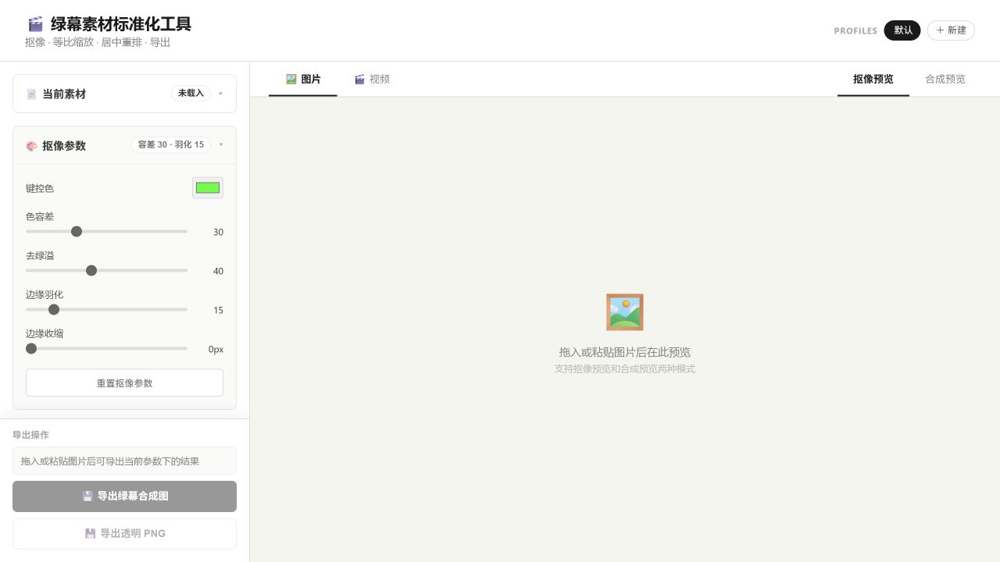
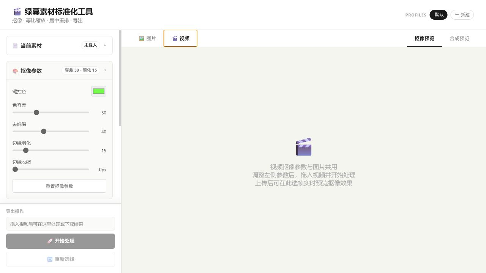

<div align="center">

# Greenscreen Studio

**Chroma keying, layout normalization, video processing, sprite sheets, and Godot 2D animation export.**

Standardize green-screen character images and videos into consistent, game-ready or video-ready assets.


[Download](https://github.com/silent-reader-cn/greenscreen-studio/releases/latest) ·
[中文说明](README.zh-CN.md)

</div>

---

Greenscreen Studio is a desktop app and local MCP toolchain for green-screen character assets. It keys images and videos, normalizes canvas/layout, exports transparent or green-screen outputs, and can generate game-ready sprite sheets and Godot `SpriteFrames` resources.

It is useful for:

- Character portraits, idle frames, walk starts, walk loops, walk stops, and eight-direction 2D animation.
- Batch green-screen image/video processing.
- Local AI/Codex asset automation through MCP.

## Screenshots





## Features

### Image And Video Processing

- Chroma keying with configurable key color, tolerance, spill suppression, feathering, and edge shrink.
- Transparent PNG/WebM/MOV output or green-screen PNG/MP4/WebM/MOV output.
- Auto-crop after keying, so transparent borders do not drive scale.
- Canvas size and character target box are configured independently.
- Layout anchors: `center`, `bottom_center`, and `feet`.
- Video pipeline powered by ffprobe, ffmpeg raw RGBA extraction, shared JS keying, and ffmpeg encoding.

### Game Animation Assets

- Exact frame export with `frames: [0, 6, 12, 19, 25, 31]`.
- Range-based sampling with `range`, `sampleEvery`, and `maxFrames`.
- Improved loop-end detection with early-frame exclusion, strict spacing, motion-aware ranking, and warnings.
- Optional cleanup for pale-green tracking marks and isolated foreground components before auto-crop.
- Godot export: atlas PNG, Godot 4 `.tres` `SpriteFrames`, and metadata JSON.
- Five-source-direction to eight-direction workflow through mirrored directions.

### MCP Automation

The stdio MCP server lives at `mcp/server.mjs`.

Primary tools:

- `inspect_image` / `export_image`
- `probe_video` / `process_video`
- `find_loop_end`
- `export_spritesheet`
- `export_godot_spriteframes`
- `validate_processing_params`

The companion Codex skill is in `skills/greenscreen-studio-mcp/`.

## Quick Start

```bash
npm install
npm run dev
```

This starts:

- Vite frontend: `http://127.0.0.1:5174/`
- Express backend: `http://127.0.0.1:3001/`
- Electron desktop window

Frontend only:

```bash
npm run dev:client
```

Backend/static server:

```bash
npm run build
npm run start
```

## MCP Configuration

```json
{
  "mcpServers": {
    "greenscreen-studio": {
      "command": "node",
      "args": ["C:/path/to/greenscreen-studio/mcp/server.mjs"],
      "cwd": "C:/path/to/greenscreen-studio"
    }
  }
}
```

Manual server start:

```bash
npm run mcp
```

## Godot SpriteFrames Example

Recommended character frame setup:

- Outer frame: `256 x 256`
- Character safe area: `160 x 160`
- Anchor: `feet`
- FPS: `12`

```json
{
  "outputPath": "C:/godot/project/characters/hero_spriteframes.tres",
  "atlasPath": "C:/godot/project/characters/hero_atlas.png",
  "metadataPath": "C:/godot/project/characters/hero_metadata.json",
  "params": {
    "mode": "transparent",
    "layout": {
      "anchor": "feet"
    },
    "cleanup": {
      "removePaleGreenMarkers": true,
      "keepLargestComponent": true,
      "removeSmallComponents": true,
      "minComponentPixels": 48
    }
  },
  "godot": {
    "frameWidth": 256,
    "frameHeight": 256,
    "safeAreaWidth": 160,
    "safeAreaHeight": 160,
    "framesPerRow": 8,
    "fps": 12,
    "godotProjectRoot": "C:/godot/project",
    "animationGroups": [
      {
        "name": "walk_loop",
        "loop": true,
        "directions": {
          "down": { "inputPath": "C:/captures/down.mp4", "frames": [0, 6, 12, 18] },
          "down_right": { "inputPath": "C:/captures/down_right.mp4", "frames": [0, 6, 12, 18] },
          "right": { "inputPath": "C:/captures/right.mp4", "frames": [0, 6, 12, 18] },
          "up_right": { "inputPath": "C:/captures/up_right.mp4", "frames": [0, 6, 12, 18] },
          "up": { "inputPath": "C:/captures/up.mp4", "frames": [0, 6, 12, 18] }
        },
        "mirror": {
          "down_left": "down_right",
          "left": "right",
          "up_left": "up_right"
        }
      }
    ]
  }
}
```

## Project Structure

```text
greenscreen-studio/
├── electron/                    # Electron main/preload
├── src/
│   ├── components/              # React panels
│   ├── lib/keying.js            # Shared keying, crop, cleanup, layout logic
│   ├── App.jsx
│   └── main.jsx
├── server.cjs                   # Express API
├── videoProcessor.cjs           # ffmpeg video and atlas pipeline
├── mcp/server.mjs               # stdio MCP server
├── skills/greenscreen-studio-mcp/
└── docs/images/                 # README screenshots
```

## Test And Package

```bash
npm test
npm run build
npm run package
```

Build artifacts are written to `release/`. The desktop app bundles `ffmpeg` and `ffprobe`, so users do not need separate video tooling installed.

## License

MIT
