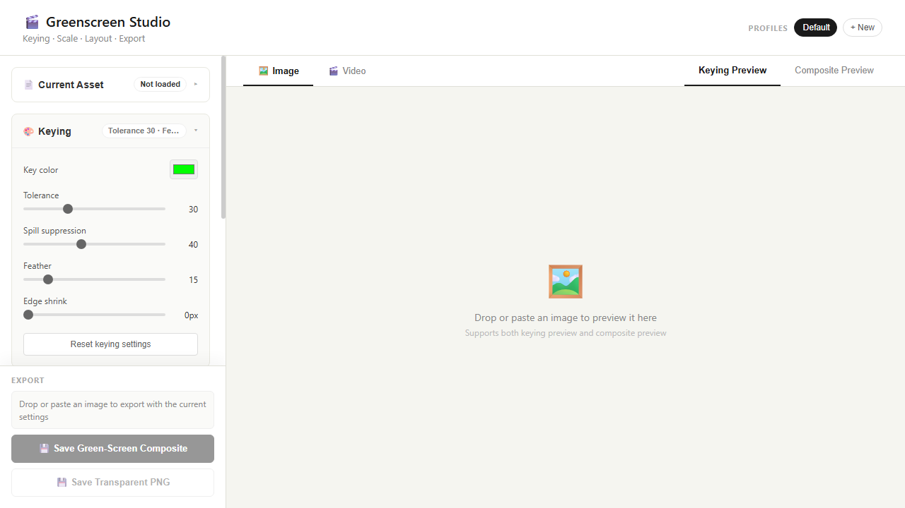

<div align="center">

# Greenscreen Studio

**Chroma keying, layout normalization, video processing, sprite sheets, and Godot 2D animation export.**

Standardize green-screen character images and videos into consistent, game-ready or video-ready assets.


[Download](https://github.com/silent-reader-cn/greenscreen-studio/releases/latest) ·
[中文说明](README.zh-CN.md)

</div>

---

Greenscreen Studio is a desktop app and local MCP toolchain for green-screen character assets. It keys images and videos, normalizes canvas/layout, exports transparent or green-screen outputs, and can generate game-ready sprite sheets and Godot `SpriteFrames` resources.

It is useful for:

- Character portraits, idle frames, walk starts, walk loops, walk stops, and eight-direction 2D animation.
- Batch green-screen image/video processing.
- Local AI/Codex asset automation through MCP.

## Screenshots



## Features

### Image And Video Processing

- Chroma keying with configurable key color, tolerance, spill suppression, feathering, and edge shrink.
- Transparent PNG/WebM/MOV output or green-screen PNG/MP4/WebM/MOV output.
- Auto-crop after keying, so transparent borders do not drive scale.
- Canvas size and character target box are configured independently.
- Layout anchors: `center`, `bottom_center`, and `feet`.
- Video pipeline powered by ffprobe, ffmpeg raw RGBA extraction, shared JS keying, and ffmpeg encoding.

### Game Animation Assets

- Exact frame export with `frames: [0, 6, 12, 19, 25, 31]`.
- Range-based sampling with `range`, `sampleEvery`, and `maxFrames`.
- Improved loop-end detection with early-frame exclusion, strict spacing, motion-aware ranking, and warnings.
- Optional cleanup for pale-green tracking marks and isolated foreground components before auto-crop.
- Desktop Godot export from the video panel:
  - exact frames or interval sampling
  - multi-clip packs from one or more uploaded videos
  - one-click `SE → SE+SW` and `SE/NE → SE/NE/SW/NW` direction packs
  - horizontal mirror clips for opposite directions
  - first-frame thumbnails for saved clips before export
  - shared naming: `character_action` packs or `character_action_direction` single clips
- Godot artifacts:
  - atlas PNG
  - Godot 4 `.tres` `SpriteFrames`
  - feet-anchored `.tscn` `AnimatedSprite2D` scene
  - metadata JSON
  - ZIP bundle for one-drop import
- Five-source-direction to eight-direction workflow through mirrored directions.

### MCP Automation

The stdio MCP server lives at `mcp/server.mjs`.

Primary tools:

- `inspect_image` / `export_image`
- `probe_video` / `process_video`
- `find_loop_end`
- `export_spritesheet`
- `export_godot_spriteframes`
- `validate_processing_params`

The companion Codex skill is in `skills/greenscreen-studio-mcp/`.

## Quick Start

```bash
npm install
npm run dev
```

This starts:

- Vite frontend: `http://127.0.0.1:5174/`
- Express backend: `http://127.0.0.1:3001/`
- Electron desktop window

Frontend only:

```bash
npm run dev:client
```

Backend/static server:

```bash
npm run build
npm run start
```

## MCP Configuration

```json
{
  "mcpServers": {
    "greenscreen-studio": {
      "command": "node",
      "args": ["C:/path/to/greenscreen-studio/mcp/server.mjs"],
      "cwd": "C:/path/to/greenscreen-studio"
    }
  }
}
```

Manual server start:

```bash
npm run mcp
```

## Desktop Godot Workflow

1. Drop a green-screen action video into the app.
2. Open **Video Settings** and switch export type to **Godot SpriteFrames**.
3. Set character name / action name (for example `wenning` + `walk`).
4. Select exact frames or a range, then either:
   - save the current clip, or
   - click `SE → SE+SW` / `SE/NE pack` / `Expand mirrors`.
5. Review the saved-clip thumbnails before export.
6. Generate Godot files and download the ZIP bundle.

Typical SE/NE pack:

1. Name the action `walk` or `walk_SE`.
2. Drop the SE video → `SE → SE+SW`.
3. Drop the NE video → `SE/NE pack`.
4. Export once. Result files use basename `wenning_walk` when character/action are filled.

## Godot SpriteFrames Example

Recommended character frame setup:

- Outer frame: `256 x 256`
- Character safe area: `160 x 160`
- Anchor: `feet`
- FPS: `12`

```json
{
  "outputPath": "C:/godot/project/characters/wenning_walk.tres",
  "atlasPath": "C:/godot/project/characters/wenning_walk_atlas.png",
  "scenePath": "C:/godot/project/characters/wenning_walk.tscn",
  "metadataPath": "C:/godot/project/characters/wenning_walk_metadata.json",
  "bundlePath": "C:/godot/project/characters/wenning_walk.zip",
  "params": {
    "mode": "transparent",
    "layout": {
      "anchor": "feet",
      "sourceCharacterHeight": 520
    },
    "cleanup": {
      "removePaleGreenMarkers": true,
      "keepLargestComponent": true,
      "removeSmallComponents": true,
      "minComponentPixels": 48
    }
  },
  "godot": {
    "characterName": "wenning",
    "actionName": "walk",
    "frameWidth": 256,
    "frameHeight": 256,
    "safeAreaWidth": 160,
    "safeAreaHeight": 160,
    "framesPerRow": 8,
    "fps": 12,
    "godotProjectRoot": "C:/godot/project",
    "animationGroups": [
      {
        "name": "walk",
        "loop": true,
        "directions": {
          "SE": { "inputPath": "C:/captures/walk_SE.mp4", "frames": [0, 6, 12, 18] },
          "NE": { "inputPath": "C:/captures/walk_NE.mp4", "frames": [0, 6, 12, 18] }
        },
        "mirror": {
          "SW": "SE",
          "NW": "NE"
        }
      }
    ]
  }
}
```

`export_godot_spriteframes` writes:

- atlas PNG
- `.tres` SpriteFrames
- feet-anchored `.tscn` AnimatedSprite2D scene
- metadata JSON
- ZIP bundle with the sibling files above

Naming defaults:

- multi-direction pack: `character_action`
- single animation: `character_action_direction`
- explicit override: `godot.exportName`

## Project Structure

```text
greenscreen-studio/
├── electron/                    # Electron main/preload
├── src/
│   ├── components/              # React panels
│   ├── lib/                     # Shared frontend helpers (keying, naming, direction packs)
│   ├── App.jsx
│   └── main.jsx
├── server.cjs                   # Express API
├── videoProcessor.cjs           # ffmpeg video and atlas pipeline
├── godotBundle.cjs              # Shared ZIP packaging
├── godotNaming.cjs              # Shared export basename rules
├── mcp/server.mjs               # stdio MCP server
├── skills/greenscreen-studio-mcp/
└── docs/images/                 # README screenshots
```

## Test And Package

```bash
npm test
npm run test:godot-smoke
npm run build
npm run package
```

`npm run test:godot-smoke` creates a real minimal green-screen video, exports a Godot ZIP through the MCP pipeline, unpacks it into a temporary Godot project, runs Godot's own import step, and loads the exported `.tscn` headlessly. It requires Godot 4.6.3 at `D:/godot/Godot_v4.6.3-stable_win64_console.exe` on this Windows development machine.

Build artifacts are written to `release/`. The desktop app bundles `ffmpeg` and `ffprobe`, so users do not need separate video tooling installed.

## License

MIT
