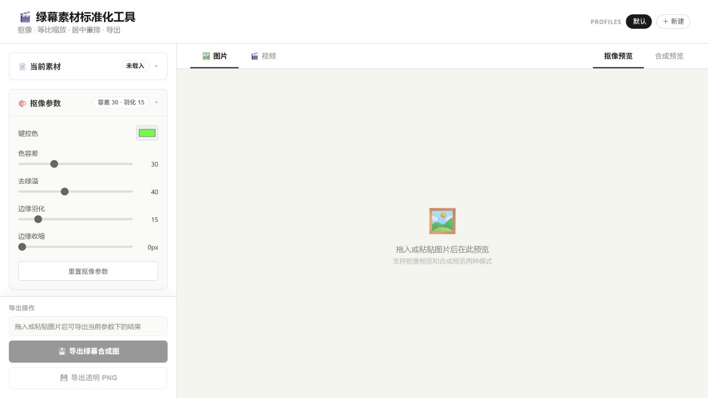
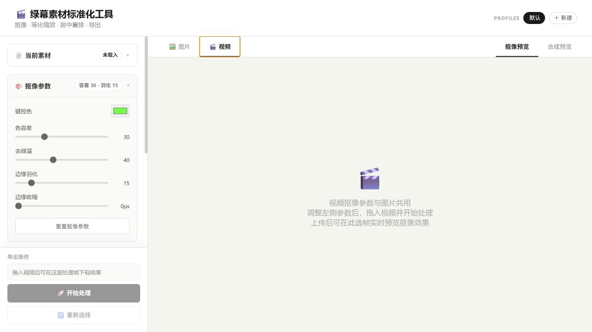

<div align="center">

# 绿幕素材标准化工具

**Greenscreen Studio** — 抠像、缩放、布局、视频处理与 Godot 2D 动画资产导出

把绿幕图片和视频整理成尺寸统一、基准线稳定、可自动化处理的游戏/视频素材。


[下载桌面版](https://github.com/silent-reader-cn/greenscreen-studio/releases/latest) ·
[English](README.md)

</div>

---

Greenscreen Studio 是一个面向绿幕人物素材的桌面工具和本地 MCP 工具链。它可以把不同尺寸、不同构图的绿幕图片或视频统一处理为标准画布，也可以把视频帧导出为游戏精灵图和 Godot `SpriteFrames` 资源。

适合：

- 游戏角色立绘、待机帧、行走循环、起步/停步片段、八方向角色动画。
- 视频素材批量抠像、透明背景 WebM/MOV、绿幕合成 MP4。
- AI/Codex 自动化素材处理流水线。

## 截图





## 功能特性

### 图片与视频处理

- 绿幕抠像：支持键控色、容差、去绿溢、边缘羽化、边缘收缩。
- 双输出模式：透明 PNG/WebM/MOV，或绿幕背景 PNG/MP4/WebM/MOV。
- 自动裁剪：先抠像再裁剪，避免绿幕边缘影响缩放。
- 统一布局：画布尺寸和人物目标框独立配置。
- 锚点布局：支持 `center`、`bottom_center`、`feet`，适合游戏角色脚底基准线。
- 视频管线：ffprobe 探测，ffmpeg 抽帧，JS 逐帧抠像，再编码输出。

### 游戏动画资产

- 精确帧导出：`frames: [0, 6, 12, 19, 25, 31]`，适合待机、起步、循环、停步片段。
- 范围采样：`range + sampleEvery + maxFrames`，可稳定控制预览或最终精灵图。
- 循环检测：结合视觉相似度、局部运动/姿态可用性、早期帧排除和可疑候选警告。
- 杂点清理：可移除浅绿色跟踪点、小型孤立组件，或只保留最大前景组件。
- 桌面端 Godot 导出（视频面板）：
  - 精确帧 / 间隔采样
  - 同源或多源视频多动画打包
  - 一键 `SE → SE+SW`、`SE/NE → SE/NE/SW/NW` 方向包
  - 水平镜像生成反向
  - 导出前方向片段首帧缩略图预览
  - 统一命名：多向包 `角色_动作`，单动画 `角色_动作_方向`
- Godot 产物：
  - atlas PNG
  - Godot 4 `.tres` `SpriteFrames`
  - 脚底锚点 `.tscn` `AnimatedSprite2D` 场景
  - metadata JSON
  - ZIP 一键导入包
- 八方向工作流：可用五个源方向生成八方向，镜像 `left/down_left/up_left`。

### MCP 自动化

本项目内置 stdio MCP 服务器，入口为 `mcp/server.mjs`。

主要工具：

- `inspect_image` / `export_image`
- `probe_video` / `process_video`
- `find_loop_end`
- `export_spritesheet`
- `export_godot_spriteframes`
- `validate_processing_params`

配套 Codex skill 位于 `skills/greenscreen-studio-mcp/`。

## 快速开始

```bash
npm install
npm run dev
```

这会同时启动：

- Vite 前端：`http://127.0.0.1:5174/`
- Express 后端：`http://127.0.0.1:3001/`
- Electron 桌面窗口

只启动前端：

```bash
npm run dev:client
```

只启动后端/静态服务：

```bash
npm run build
npm run start
```

## MCP 配置

```json
{
  "mcpServers": {
    "greenscreen-studio": {
      "command": "node",
      "args": ["C:/path/to/greenscreen-studio/mcp/server.mjs"],
      "cwd": "C:/path/to/greenscreen-studio"
    }
  }
}
```

手动启动：

```bash
npm run mcp
```

## 桌面端 Godot 工作流

1. 把绿幕动作视频拖进应用。
2. 打开 **视频参数**，导出类型切到 **Godot SpriteFrames**。
3. 填写角色名 / 动作名（例如 `温宁` + `walk`）。
4. 选择精确帧或区间，然后：
   - 保存当前片段，或
   - 点 `SE → SE+SW` / `SE/NE 四向包` / `补齐镜像`。
5. 先看已保存片段缩略图，确认方向和镜像。
6. 生成 Godot 文件，优先下载 ZIP 包。

常见 SE/NE 流程：

1. 动画名填 `walk` 或 `walk_SE`。
2. 拖入 SE 视频 → `SE → SE+SW`。
3. 拖入 NE 视频 → `SE/NE 四向包`。
4. 一次导出。填了角色/动作后，文件基名类似 `温宁_walk`。

## Godot SpriteFrames 示例

推荐角色帧设置：

- 外框：`256 x 256`
- 安全区：`160 x 160`
- 锚点：`feet`
- FPS：`12`

```json
{
  "outputPath": "C:/godot/project/characters/wenning_walk.tres",
  "atlasPath": "C:/godot/project/characters/wenning_walk_atlas.png",
  "scenePath": "C:/godot/project/characters/wenning_walk.tscn",
  "metadataPath": "C:/godot/project/characters/wenning_walk_metadata.json",
  "bundlePath": "C:/godot/project/characters/wenning_walk.zip",
  "params": {
    "mode": "transparent",
    "layout": {
      "anchor": "feet",
      "sourceCharacterHeight": 520
    },
    "cleanup": {
      "removePaleGreenMarkers": true,
      "keepLargestComponent": true,
      "removeSmallComponents": true,
      "minComponentPixels": 48
    }
  },
  "godot": {
    "characterName": "wenning",
    "actionName": "walk",
    "frameWidth": 256,
    "frameHeight": 256,
    "safeAreaWidth": 160,
    "safeAreaHeight": 160,
    "framesPerRow": 8,
    "fps": 12,
    "godotProjectRoot": "C:/godot/project",
    "animationGroups": [
      {
        "name": "walk",
        "loop": true,
        "directions": {
          "SE": { "inputPath": "C:/captures/walk_SE.mp4", "frames": [0, 6, 12, 18] },
          "NE": { "inputPath": "C:/captures/walk_NE.mp4", "frames": [0, 6, 12, 18] }
        },
        "mirror": {
          "SW": "SE",
          "NW": "NE"
        }
      }
    ]
  }
}
```

`export_godot_spriteframes` 会写出：

- atlas PNG
- `.tres` SpriteFrames
- 脚底锚点 `.tscn` AnimatedSprite2D 场景
- metadata JSON
- 包含上述同级文件的 ZIP 包

命名默认规则：

- 多向包：`角色_动作`
- 单动画：`角色_动作_方向`
- 显式覆盖：`godot.exportName`

## 项目结构

```text
greenscreen-studio/
├── electron/                    # Electron 主进程与 preload
├── src/
│   ├── components/              # React UI 面板
│   ├── lib/                     # 前端共享逻辑（抠像、命名、方向包）
│   ├── App.jsx
│   └── main.jsx
├── server.cjs                   # Express API
├── videoProcessor.cjs           # ffmpeg 视频与图集管线
├── godotBundle.cjs              # 共享 ZIP 打包
├── godotNaming.cjs              # 共享导出命名规则
├── mcp/server.mjs               # stdio MCP 服务器
├── skills/greenscreen-studio-mcp/
└── docs/images/                 # README 截图
```

## 测试与打包

```bash
npm test
npm run test:godot-smoke
npm run build
npm run package
```

`npm run test:godot-smoke` 会生成真实最小绿幕视频，经 MCP 管线导出 Godot ZIP，解压到临时 Godot 项目，运行 Godot 自身 import，再 headless 加载导出的 `.tscn`。当前 Windows 开发机要求 Godot 4.6.3 位于 `D:/godot/Godot_v4.6.3-stable_win64_console.exe`。

打包输出位于 `release/`。桌面版内置 `ffmpeg` 和 `ffprobe`，用户不需要单独安装视频工具。

## 许可

MIT
