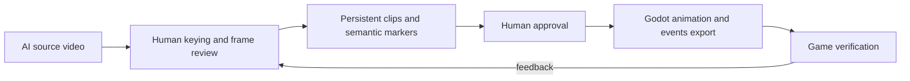

# Action Asset Review Workbench

## Goal

Turn one AI-generated source video into reviewable action clips with semantic frame events, then deliver approved clips as Godot-ready animation assets and machine-readable event tracks.

## Workflow Contract

## Acceptance Rules

- A source video may own any number of named clips.
- A clip stores an inclusive start frame and exclusive end frame.
- A clip may own any number of semantic markers.
- Markers use a fixed machine-readable type plus an optional human label and JSON payload.
- Only `approved` clips may be queued for AI export.
- Godot export contains the clip range and an `events.json` companion artifact.
- Every completed checklist item has focused tests and a build verification before its Git commit.

## Semantic Marker Types

| Type | Meaning |
| --- | --- |
| `clip_start` | Clip boundary start |
| `clip_end` | Clip boundary end |
| `loop_start` | Enter loop region |
| `loop_end` | Exit loop region |
| `windup_end` | Startup has finished |
| `active_start` | Damage or interaction window opens |
| `hit` | Damage, sound, and VFX trigger frame |
| `active_end` | Damage or interaction window closes |
| `recovery_start` | Recovery has started |
| `cancel_open` | Action may cancel into another state |
| `sfx` | Sound trigger |
| `vfx` | Visual-effect trigger |
| `camera` | Camera cue |
| `note` | Human-only note |

## Delivery Checklist

- [x] **Data model and API**: Persist clips, markers, review state, and clip-version metadata against a project asset. (commit `7dd6cac`)
- [x] **Review timeline**: Create, edit, delete, and select multiple clips from the video workbench. (commit `327860c`)
- [x] **Semantic markers**: Add, move, edit, and remove typed frame markers within a selected clip. (commit `774eaf4`)
- [x] **Approval gate**: Move clips through `draft`, `needs_review`, `approved`, `exported`, `verified_in_game`, and `rejected`. (commit `f746ebc`)
- [x] **Godot event artifact**: Export approved clip events as `events.json` beside the atlas, SpriteFrames, scene, metadata, and ZIP.
- [ ] **AI collaboration gate**: Queue and claim export work only for approved clips; include immutable clip and marker data in the task payload.
- [ ] **Automated review checks**: Surface loop-boundary, foreground-area, feet-anchor, crop, and frame-jitter warnings before approval.
- [ ] **Godot handoff**: Include an import-friendly event track and a minimal Godot dispatcher reference in exported metadata.
- [ ] **End-to-end verification**: Test project persistence, API validation, UI editing, export artifacts, and a real Godot import smoke path.
